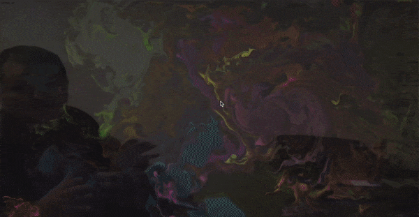

# Hadouken AR

An interactive AR playground using the camera in your device to detect your hands, drawing a fluid effect where the hand is detected.

The main idea was to create an Augmented Reality hadouken, but the hands detection still needs more work.
For instance, the elbows are also detected, works better if your elbow is not visible (put your arms straight in front of you).  

Still a work in progress, but fun enough to give a try ;)

[Live demo here](https://ignaciotcrespo.github.io/hadouken-ar/)

### Some video samples:

A very sad hadouken :( 



Fluids with your hands.


### Settings

The settings can be changed in hadouken.js file.
```javascript
const hadouken = {

    // draw a square where a hand is detected
    drawHandBox: false,

    // black alpha in top of video, to make it darker. Set a lower value to make the video clearer.
    darkLayerOpacity: 0.4,

    // draw fps in top/left corner
    drawFps: false,

    // margin at right of vieo to show the controls to manage the fluid effects.
    rightMarginForControls: 0.20,

    // set here your own callback for hands detector.
    // the current detector draws the fluid
    // Parameters: posX, posY
    handsDetectorCallback: onHandDetected,
        
    // hand detection parameters. More info here: [https://github.com/victordibia/handtrack.js]()
    handDetectionModelParams: {
      flipHorizontal: true,   // flip video
      maxNumBoxes: 1,        // maximum number of boxes (hands) to detect
      iouThreshold: 0.5,      // ioU threshold for non-max suppression
      scoreThreshold: 0.79,    // confidence threshold for predictions.
    },

}
```

## Engine for hands detection

I started the hands detection myself, using tensorflow, but it was very buggy.
Then I've decided to get help from the community, and found this one and worked a bit better:

Handtrack.js: [https://github.com/victordibia/handtrack.js]

I've modified some parts to optionally draw the FPS and boxes.

I am trying with another detection engine, looks promising.

## Engine for fluid simulation

WebGL-Fluid-Simulation: [https://paveldogreat.github.io/WebGL-Fluid-Simulation/]

## Known issues

* The hands detection needs some polishing. In my case it works better with my hands closed. The power of the fist, Sensei!
* With the current hands detection engine there is no way to identify which hand was detected, we just get X,Y position.
* Works better only with one hand.
* Tested only in Chrome.
* Using and modified the compressed version of handtrack library. The not-minimized version does not work yet.
* Works in mobile devices, but SUPER slow

## License

MIT License

Copyright (c), 2020, Ignacio Tomas Crespo

Permission is hereby granted, free of charge, to any person obtaining a copy
of this software and associated documentation files (the "Software"), to deal
in the Software without restriction, including without limitation the rights
to use, copy, modify, merge, publish, distribute, sublicense, and/or sell
copies of the Software, and to permit persons to whom the Software is
furnished to do so, subject to the following conditions:

The above copyright notice and this permission notice shall be included in all
copies or substantial portions of the Software.

THE SOFTWARE IS PROVIDED "AS IS", WITHOUT WARRANTY OF ANY KIND, EXPRESS OR
IMPLIED, INCLUDING BUT NOT LIMITED TO THE WARRANTIES OF MERCHANTABILITY,
FITNESS FOR A PARTICULAR PURPOSE AND NONINFRINGEMENT. IN NO EVENT SHALL THE
AUTHORS OR COPYRIGHT HOLDERS BE LIABLE FOR ANY CLAIM, DAMAGES OR OTHER
LIABILITY, WHETHER IN AN ACTION OF CONTRACT, TORT OR OTHERWISE, ARISING FROM,
OUT OF OR IN CONNECTION WITH THE SOFTWARE OR THE USE OR OTHER DEALINGS IN THE
SOFTWARE.
