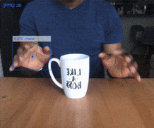

# Hadouken AR

An interactive AR playground using the camera in your device to detect your hands, drawing a fluid effect where the hand is detected.

The main idea was to create an Augmented Reality hadouken, but the hands detection still needs more work.
For instance, the elbows are also detected, works better if your elbow is not visible (put your arms straight in front of you).  

Still a work in progress, but fun enough to give a try ;)

[Live demo here: Engine 2](https://ignaciotcrespo.github.io/hadouken-AR-engine2/)
In this demo the fluids simulation is drawn only when your hand is open and the fingers pointing up.

[Live demo here: Engine 1](https://ignaciotcrespo.github.io/hadouken-ar/)
This is the first version, using a library detecting the hands position, but not the fingers.

The authors of these libraries did a great job using tensorflow and mediapipe. To get deeper in the techniques used in this AR experiment, take some minutes to visit the links described below.
I enjoyed reading it.

## UPDATE 14/Nov/2020

Added face detection to draw fire in the eyes when the fluids simulation is active in the hand. To enable it check the "Eyes" setting in the menu.
The render will be slower because hands and face detection will work together.

### Some video samples:

#### Using hands detection engine 2

A not-so-good hadouken ;)


Be a wizard! Fingers detection is useful to draw the effects only when the hand is open.


#### Using hands detection engine 1

A very sad hadouken :( 


Fluids simulation with your hands.


### Settings

The settings can be changed in hadouken.js file.
```javascript
const hadouken = {

    // engine used for hands detection.
    // engine 1 is simple, and can detect many hands, but can not detect fingers.
    // engine 2 is better, some comments:
    //      - can detect fingers!
    //      - issue: detects only one hand.
    //      - I've decided to draw fluids simulation only when the hand is open, with the fingers up. It has a "wizard" feeling.
    handsDetectionEngine: 2,

    // engine 1: draw a square where a hand is detected
    // engine 2: draw a hand skeleton where a hand is detected
    drawHandBox: false,

    // black alpha in top of video, to make it darker. Set a lower value to make the video clearer.
    darkLayerOpacity: 0.4,

    // hand detection parameters
    handDetectionModelParams: {
      flipHorizontal: true,   // flip e.g for video

      // valid only for detection engine 1
      maxNumBoxes: 1,        // maximum number of boxes to detect
      iouThreshold: 0.5,      // ioU threshold for non-max suppression
      scoreThreshold: 0.79,    // confidence threshold for predictions.
    },

    // draw fps in top/left corner (currently it works only in detection engine 1)
    drawFps: false,

    // margin at right of vieo to show the controls to manage the fluid effects.
    rightMarginForControls: 0.20,

    // set here your own callback for hands detector, in case you create your own detector.
    handsDetectorCallback: onHandDetected,

    // enable face detection
    eyes: false,

    // callback for faces detected (to draw the eyes when the fluids simulation is active in the hand)
    faceDetectorCallback: onFaceDetected,

    // set to false to disable fluids
    drawFluids: true,

    // the callback when the video recording is ready
    // parameters: width, height
    onVideoInitialized: handsDetectorVideoInitialized,

}
```

## Engine for hands detection

### Engine 2: detect fingers, allowing to check when the hand is open, etc.

This engine takes longer to load than engine 1, but including fingers detection is a big plus.

Handpose: <https://blog.tensorflow.org/2020/03/face-and-hand-tracking-in-browser-with-mediapipe-and-tensorflowjs.html>

I've modified some parts to optionally draw hand skeletons, and to resize the fluids simulator when the video starts rendering.

### Engine 1: the first approach. Simple, detect many hands, but can not detect fingers

I started the hands detection myself, using tensorflow, but it was very buggy.
Then I've decided to get help from the community, and found this one and worked a bit better:

Handtrack.js: <https://github.com/victordibia/handtrack.js>

I've modified some parts to optionally draw the FPS and boxes.

### A quick comparation

Engine 1 | Engine 2
--- | ---
 | 

## Engine for fluid simulation

WebGL-Fluid-Simulation: [https://paveldogreat.github.io/WebGL-Fluid-Simulation/]()

Someone in the office shared this link and I couldn't stop watching it. I love it :)
And the idea of doing a hadouken with augmented reality is not only mine, there are other devs doing something similar.  
I've decided to implement my version to learn more about ML, and have fun.

## Fire particles

For the eyes on fir I've took this small piece of code, simple and good.

<https://codepen.io/davepvm/pen/Hhstl>

## Known issues

* Engine 1: The hands detection needs some polishing. In my case it works better with my hands closed. The power of the fist, Sensei!
* With the current hands detection engine there is no way to identify which hand was detected, we just get X,Y position.
* Works better only with one hand.
* Tested only in Chrome.
* Using and modified the compressed version of hands detection library. The not-minimized version does not work yet.
* Works in mobile devices, but SUPER slow

## License

MIT License

Copyright (c), 2020, Ignacio Tomas Crespo

Permission is hereby granted, free of charge, to any person obtaining a copy
of this software and associated documentation files (the "Software"), to deal
in the Software without restriction, including without limitation the rights
to use, copy, modify, merge, publish, distribute, sublicense, and/or sell
copies of the Software, and to permit persons to whom the Software is
furnished to do so, subject to the following conditions:

The above copyright notice and this permission notice shall be included in all
copies or substantial portions of the Software.

THE SOFTWARE IS PROVIDED "AS IS", WITHOUT WARRANTY OF ANY KIND, EXPRESS OR
IMPLIED, INCLUDING BUT NOT LIMITED TO THE WARRANTIES OF MERCHANTABILITY,
FITNESS FOR A PARTICULAR PURPOSE AND NONINFRINGEMENT. IN NO EVENT SHALL THE
AUTHORS OR COPYRIGHT HOLDERS BE LIABLE FOR ANY CLAIM, DAMAGES OR OTHER
LIABILITY, WHETHER IN AN ACTION OF CONTRACT, TORT OR OTHERWISE, ARISING FROM,
OUT OF OR IN CONNECTION WITH THE SOFTWARE OR THE USE OR OTHER DEALINGS IN THE
SOFTWARE.
